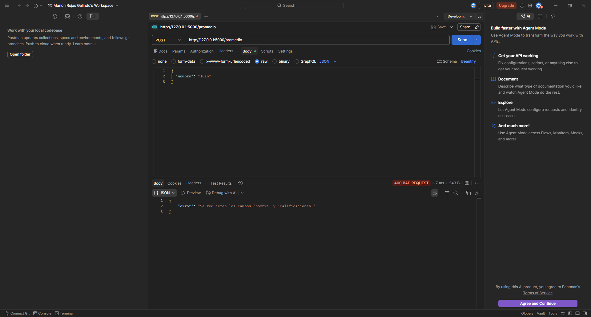
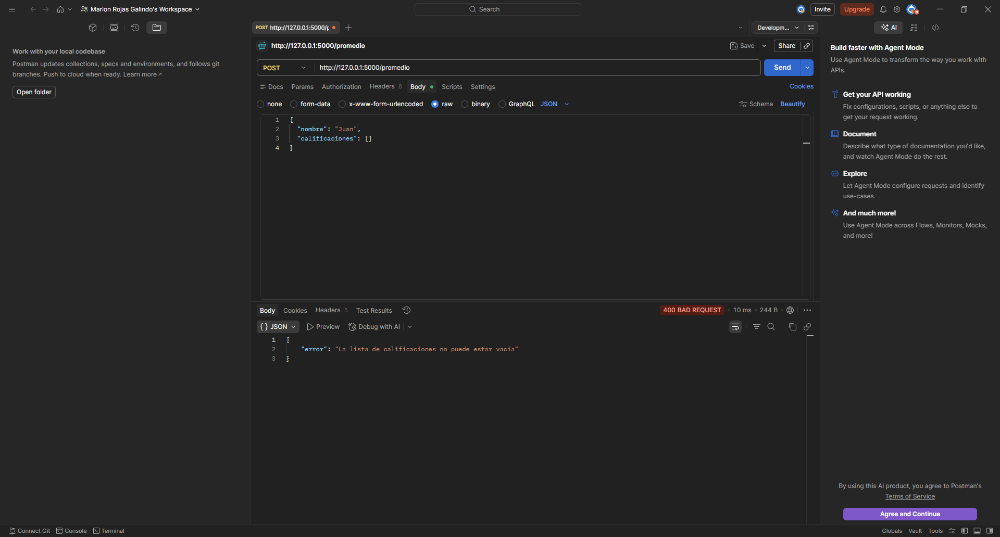
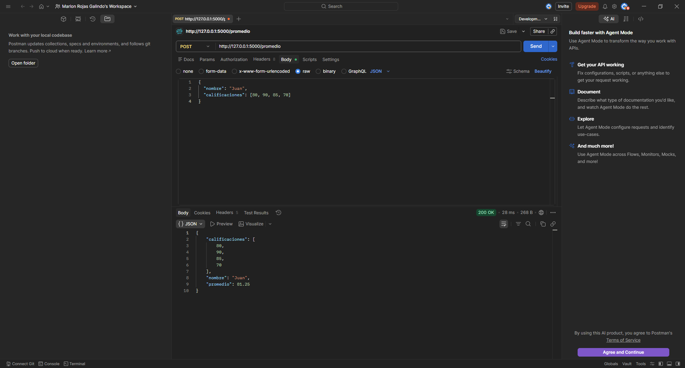
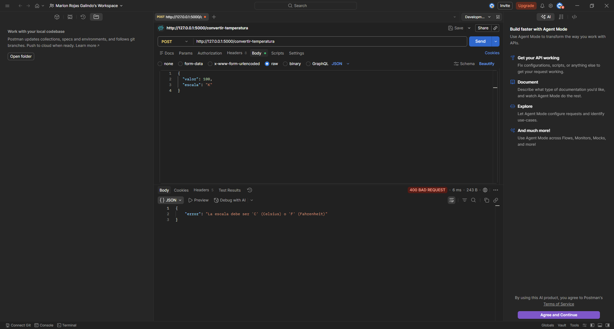
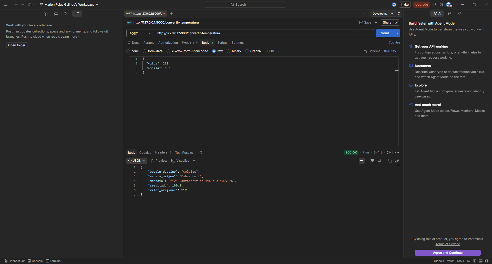
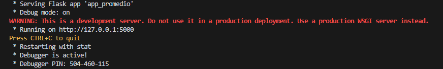

# 🚀 API Conversor y Promedio

API desarrollada en **Flask** que permite:

* 📊 Calcular el promedio de calificaciones de un alumno
* 🌡️ Convertir temperaturas entre Celsius y Fahrenheit

Este proyecto forma parte de una práctica enfocada en el desarrollo de APIs REST, validación de datos y manejo de errores.

---

## 📁 Estructura del proyecto

```
API_CONVERSOR_PROMEDIO/
│
├── .venv/
├── screenshots/
├── .env
├── .gitignore
├── app_conversor.py
├── app_promedio.py
└── requirements.txt
```

---

## ⚙️ Instalación

1. Clonar el repositorio:

```bash
git clone https://github.com/tu-usuario/tu-repo.git
cd API_CONVERSOR_PROMEDIO
```

2. Crear entorno virtual:

```bash
python -m venv .venv
source .venv/bin/activate  # Linux/Mac
.venv\Scripts\activate     # Windows
```

3. Instalar dependencias:

```bash
pip install -r requirements.txt
```

---

## 🔐 Variables de entorno

Archivo `.env`:

```
FLASK_ENV=development
FLASK_DEBUG=True
FLASK_RUN_HOST=127.0.0.1
FLASK_RUN_PORT=5000
SECRET_KEY=tu_clave_secreta
```

---

## ▶️ Ejecución

### API Promedio

```bash
python app_promedio.py
```

### API Conversor

```bash
python app_conversor.py
```

---

# 📊 Endpoint: Promedio

## 📌 POST /promedio

Calcula el promedio de un alumno.

### 📥 Request

```json
{
  "nombre": "Juan",
  "calificaciones": [80, 90, 100]
}
```

### 📤 Response

```json
{
  "nombre": "Juan",
  "calificaciones": [80, 90, 100],
  "promedio": 90.0
}
```

---

## ❌ Manejo de errores

### Campo faltante



### Lista vacía



---

## ✅ Caso exitoso



---

# 🌡️ Endpoint: Conversor de Temperatura

## 📌 POST /convertir-temperatura

Convierte temperaturas entre Celsius y Fahrenheit.

---

### 📥 Request

```json
{
  "valor": 25,
  "escala": "C"
}
```

---

### 📤 Response

```json
{
  "valor_original": 25,
  "escala_origen": "Celsius",
  "resultado": 77.0,
  "escala_destino": "Fahrenheit",
  "mensaje": "25° Celsius equivale a 77.0°F"
}
```

---

## ❌ Manejo de errores

### Escala inválida



### Valor no numérico


---

## ✅ Casos exitosos

### Celsius a Fahrenheit


### Fahrenheit a Celsius



---

# 🖥️ Ejecución en consola



---

## 🛠️ Tecnologías utilizadas

* Python 🐍
* Flask 🌐
* python-dotenv 🔐

---

## 📌 Características

* Validación de datos en requests
* Manejo de errores HTTP (400)
* Uso de variables de entorno
* API REST estructurada
* Respuestas en formato JSON

---

## 👨‍💻 Autor

**Marlon Rojas Galindo**

---

## 📄 Licencia

Este proyecto es de uso académico.
